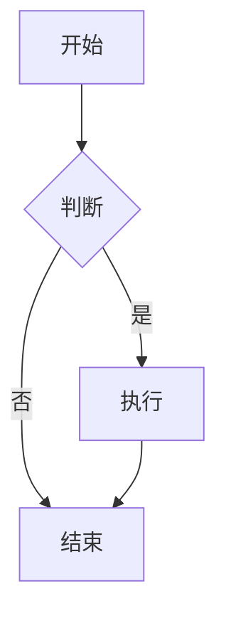

# x-markdown-core

增强的 Markdown 渲染组件，支持同步和异步渲染，提供丰富的自定义功能。

## 使用

### 基础用法

```vue
<script setup>
import { MarkdownRenderer, MarkdownRendererAsync } from '@/components/x-markdown-core'

const content = '# Hello World\n\nThis is **markdown** content.'
</script>

<template>
  <!-- 同步渲染 -->
  <MarkdownRenderer class="markdown-render" :markdown="content" />
  
  <!-- 异步渲染 -->
  <Suspense>
    <MarkdownRendererAsync class="markdown-render" :markdown="content" />
  </Suspense>
</template>
```

### 完整用法

```vue
<script setup>
import { MarkdownRenderer } from '@/components/x-markdown-core'

const content = '# Hello World\n\n```javascript\nconsole.log("Hello");\n```'

const customAttrs = {
  heading: (node, { level }) => ({
    class: ['heading', `heading-${level}`]
  }),
  a: node => ({
    target: '_blank',
    rel: 'noopener noreferrer'
  })
}

const codeXRender = {
  echarts: (props) => {
    // 自定义 echarts 渲染逻辑
    return h('div', { class: 'echarts-container' })
  }
}
</script>

<template>
  <MarkdownRenderer
    :markdown="content"
    :custom-attrs="customAttrs"
    :code-x-render="codeXRender"
    enable-latex
    enable-code-line-number
    :is-dark="true"
  />
</template>
```

## 属性

### 基础属性

| 属性 | 类型 | 默认值 | 描述 |
|------|------|--------|------|
| markdown | String | '' | Markdown 内容 |
| allowHtml | Boolean | true | 是否允许 HTML |
| enableLatex | Boolean | true | 是否启用 LaTeX 支持 |
| enableBreaks | Boolean | true | 是否启用换行符 |
| enableCodeLineNumber | Boolean | false | 是否显示代码行号 |
| isDark | Boolean | false | 是否使用暗色主题 |

### 代码相关

| 属性 | 类型 | 默认值 | 描述 |
|------|------|--------|------|
| codeXRender | Object | () => ({}) | 自定义代码块渲染器 |
| codeXSlot | Object | () => ({}) | 自定义代码块插槽 |
| codeHighlightTheme | Object | null | 代码高亮主题 |
| langs | Array | [] | 支持的语言列表 |
| secureViewCode | Boolean | false | 是否安全查看代码 |
| needViewCodeBtn | Boolean | true | 是否需要查看代码按钮 |

### 插件配置

| 属性 | 类型 | 默认值 | 描述 |
|------|------|--------|------|
| remarkPlugins | Array | [] | remark 插件列表 |
| remarkPluginsAhead | Array | [] | 前置 remark 插件 |
| rehypePlugins | Array | [] | rehype 插件列表 |
| rehypePluginsAhead | Array | [] | 前置 rehype 插件 |
| rehypeOptions | Object | () => ({}) | rehype 配置选项 |
| sanitize | Boolean | false | 是否启用内容清理 |
| sanitizeOptions | Object | () => ({}) | 清理选项 |

### 主题和样式

| 属性 | 类型 | 默认值 | 描述 |
|------|------|--------|------|
| defaultThemeMode | String | 'light' | 默认主题模式 |
| colorReplacements | Object | () => ({}) | 颜色替换配置 |
| mermaidConfig | Object | () => ({}) | Mermaid 图表配置 |

### 自定义属性

通过 `customAttrs` 可以对 Markdown 渲染的节点动态添加自定义属性：

```ts
const customAttrs = {
  heading: (node, { level }) => ({
    class: ['heading', `heading-${level}`]
  }),
  a: node => ({
    target: '_blank',
    rel: 'noopener noreferrer'
  })
}
```

## 插槽

组件提供了多个插槽，可以自定义渲染逻辑。标签即为插槽名，你可以接管任何插槽，自定义渲染逻辑。

**请注意：组件内部拦截了 code 标签的渲染，支持高亮代码块，mermaid 图表等。如果你需要自定义渲染，可以接管 code 插槽。**

```vue
<MarkdownRenderer>
  <template #heading="{ node, level }">
    <h{{ level }} class="custom-heading">
      {{ node.children[0].value }}
    </h{{ level }}>
  </template>
  
  <template #code="{ raw }">
    <pre class="custom-code"><code>{{ raw }}</code></pre>
  </template>
</MarkdownRenderer>
```

## 代码块渲染

组件内置了代码块渲染器，支持高亮代码块，mermaid 图表等。

### Mermaid 图表支持

组件内置了 Mermaid 图表支持，无需额外配置即可使用。只需在 Markdown 中使用 mermaid 代码块：

````markdown

````

支持的配置：

```vue
<MarkdownRenderer
  :markdown="content"
  :mermaid-config="{
    theme: 'default',
    themeVariables: {
      primaryColor: '#ff0000'
    }
  }"
  :is-dark="false"
/>
```

### 数学公式支持

组件内置了数学公式支持，基于 KaTeX 渲染引擎，默认启用。支持行内公式和块级公式。

#### 行内公式

使用单个 `$` 包裹公式：

```markdown
这是一个行内公式：$E = mc^2$，爱因斯坦质能方程。

勾股定理：$a^2 + b^2 = c^2$
```

#### 块级公式

使用双 `$$` 包裹公式，公式会独立成行并居中显示：

```markdown
$$
\frac{-b \pm \sqrt{b^2 - 4ac}}{2a}
$$

$$
\begin{aligned}
\nabla \times \vec{\mathbf{B}} -\, \frac1c\, \frac{\partial\vec{\mathbf{E}}}{\partial t} &= \frac{4\pi}{c}\vec{\mathbf{j}} \\
\nabla \cdot \vec{\mathbf{E}} &= 4 \pi \rho \\
\nabla \times \vec{\mathbf{E}}\, +\, \frac1c\, \frac{\partial\vec{\mathbf{B}}}{\partial t} &= \vec{\mathbf{0}} \\
\nabla \cdot \vec{\mathbf{B}} &= 0
\end{aligned}
$$
```

#### 常用数学符号示例

```markdown
- 希腊字母：$\alpha, \beta, \gamma, \Delta, \Omega$
- 上下标：$x^2, x_i, x^{2y}, x_{i,j}$
- 分数：$\frac{1}{2}, \frac{a+b}{c+d}$
- 根号：$\sqrt{2}, \sqrt[3]{8}$
- 求和：$\sum_{i=1}^{n} x_i$
- 积分：$\int_0^1 f(x)dx$
- 极限：$\lim_{x \to \infty} f(x)$
- 矩阵：$\begin{bmatrix} a & b \\ c & d \end{bmatrix}$
```

#### 支持的公式格式

组件支持多种数学公式格式，所有格式都会自动转换为标准格式：

| 格式类型 | 标准格式 | 扩展格式 | 说明 |
|---------|---------|---------|------|
| 行内公式 | `$...$` | `\(...\)` | LaTeX 标准行内格式 |
| 块级公式 | `$$...$$` | `\[...\]`、`[...]` | LaTeX 标准块级格式和简化格式 |

**示例**：

```markdown
<!-- 标准格式 -->
行内公式：$E = mc^2$
块级公式：
$$
\int_a^b f(x)dx
$$

<!-- 扩展格式（自动转换） -->
行内公式：\(E = mc^2\)
块级公式：
\[
\int_a^b f(x)dx
\]

或者：
[
\int_a^x f^{(n+1)}(t) \frac{(x - t)^n}{n!} , dt
]
```

#### 配置选项

```vue
<MarkdownRenderer
  :markdown="content"
  :enable-latex="true"
/>
```

如果需要禁用数学公式支持，设置 `:enable-latex="false"`。

### 自定义代码块渲染

可通过 `codeXRender` 属性自定义代码块语言渲染器（会覆盖默认的 mermaid 渲染器）：

```ts
const codeXRender = {
  echarts: (props) => {
    return h('div', { class: 'echarts-container' })
  },
  // 覆盖默认的 mermaid 渲染器
  mermaid: (props) => {
    return h('div', { class: 'custom-mermaid-container' })
  }
}
```

### 代码块顶部插槽

可通过 `codeXSlot` 自定义代码块顶部：

```vue
<MarkdownRenderer>
  <template #codeX="{ language, code }">
    <div class="code-header">
      <span>{{ language }}</span>
      <button @click="copyCode">复制</button>
    </div>
  </template>
</MarkdownRenderer>
```

## 性能优化

- 对于大量内容，建议使用 `MarkdownRendererAsync` 进行异步渲染
- 合理配置插件，避免不必要的插件加载
- 使用 `sanitize` 选项确保内容安全

## 浏览器兼容性

- 现代浏览器（Chrome, Firefox, Safari, Edge）
- Vue 3.0+
- 支持 ES6+ 特性

## 更新日志

### v1.0.0 (2025-09-03)
- 重构组件架构，提升代码可维护性
- 统一属性定义，减少重复代码
- 优化同步和异步组件的实现
- 改善文件结构和导出方式
